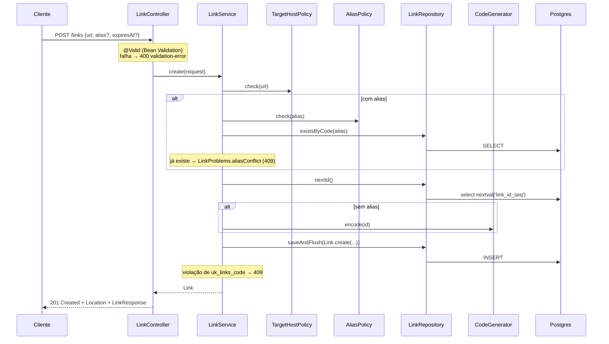
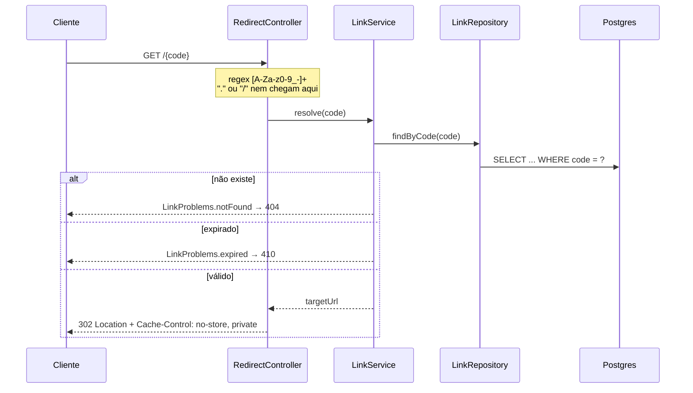

# 01 · Estrutura e fluxo de requisições

**Em uma frase:** o Link Pulse é uma API Spring Boot organizada por funcionalidade, em que `POST /links` cria um link no Postgres e `GET /{code}` o resolve e responde 302 para a URL original.

## Conceitos

### API sem frontend, sem autenticação

O projeto é só backend: uma API HTTP que recebe e devolve JSON (e um redirect). Não há páginas, login nem usuários. Segundo o README da raiz, ela "cria links curtos (gerados ou com alias) e redireciona para a URL original com 302".

### Camadas de uma aplicação web

Uma requisição costuma atravessar três papéis:

- **Controller:** recebe o HTTP, converte o JSON em objeto, valida e devolve a resposta.
- **Service:** aplica as regras de negócio e coordena a transação.
- **Repository:** conversa com o banco.

Os erros "de negócio" (link inexistente, alias repetido) viram exceções que um tratador central traduz para respostas HTTP.

### Organização por funcionalidade × por camada

Há dois jeitos comuns de montar pacotes. Por **camada técnica** (`controllers/`, `services/`, `repositories/`), cada funcionalidade fica espalhada em várias pastas. Por **funcionalidade** (`link/`), tudo o que trata de links fica junto, e só o que é transversal (configuração, tratamento de erro) fica fora. O Link Pulse usa a segunda forma.

## No Link Pulse

### Mapa do repositório

Gerado a partir de `git ls-files` (só arquivos versionados):

```text
.
├── .github/            # CI (workflows/ci.yml) e Dependabot (dependabot.yml)
├── .planning/          # Planejamento do projeto: ROADMAP, STATE, planos de cada fase
├── app/                # A aplicação Java (projeto Maven)
├── .gitattributes      # Fim de linha por tipo de arquivo (LF/CRLF), ver guia 07
├── .gitignore
├── Makefile            # Atalhos: help, build, test, verify, run, db-up, db-down
├── README.md           # Documentação principal da API
└── compose.dev.yaml    # Postgres 18 local para desenvolvimento
```

Dentro de `app/`:

```text
app/
├── .mvn/wrapper/maven-wrapper.properties  # Versão fixa do Maven + SHA-256 (guia 07)
├── config/
│   ├── checkstyle/checkstyle.xml          # Regras de estilo
│   └── spotbugs/exclude.xml               # Exclusões justificadas do SpotBugs
├── mvnw / mvnw.cmd                        # Maven wrapper (POSIX e Windows)
├── pom.xml                                # Dependências e plugins
└── src/
    ├── main/java/dev/linkpulse/           # Código da aplicação
    ├── main/resources/                    # application*.yml e changelogs do Liquibase
    └── test/java/dev/linkpulse/           # Testes unitários (*Test) e de integração (*IT)
```

### Pacotes `dev.linkpulse.*`

| Pacote | Conteúdo | Papel |
|--------|----------|-------|
| `dev.linkpulse` | `LinkPulseApplication` | Ponto de entrada (`main`) |
| `dev.linkpulse.config` | `ApplicationConfig`, `LinkPulseProperties`, `OpenApiConfig` | Beans de infraestrutura, propriedades `linkpulse.*` e metadados do OpenAPI |
| `dev.linkpulse.common` | `GlobalExceptionHandler` | Tradução central de exceções para Problem Details |
| `dev.linkpulse.common.validation` | `HttpUrl`, `HttpUrlValidator` | Constraint própria de Bean Validation para URLs |
| `dev.linkpulse.link` | `LinkController`, `RedirectController`, `LinkService`, `LinkRepository`, `Link`, `CodeGenerator`, `AliasPolicy`, `TargetHostPolicy`, `LinkProblems`, `CreateLinkRequest`, `LinkResponse` | Tudo sobre links: HTTP, regras, persistência e erros |

O pacote `link/` concentra a funcionalidade inteira. Quando a Phase 2 trouxer cliques e estatísticas, a tendência é ganhar pacotes irmãos em vez de inchar pastas por camada (ver guia 10).

### Fluxo de `POST /links`



Passo a passo, conferido em `app/src/main/java/dev/linkpulse/link/LinkService.java`:

1. `LinkController.create` recebe `@Valid @RequestBody CreateLinkRequest`. Se a validação falhar, o controller nem é chamado e a resposta é 400 (guia 05).
2. `LinkService.create` (anotado com `@Transactional`) chama primeiro `TargetHostPolicy.check(request.url())`: o destino não pode ser o próprio encurtador, loopback nem IP numérico ofuscado.
3. Se veio alias: `AliasPolicy.check(alias)` (formato e palavras reservadas) e depois `LinkRepository.existsByCode(alias)`. Se já existe, lança `LinkProblems.aliasConflict(alias)`, que vira 409.
4. `LinkRepository.nextId()` pega o próximo valor da sequência `link_id_seq`.
5. O código é o alias ou `CodeGenerator.encode(id)` (guia 04).
6. `repository.saveAndFlush(Link.create(id, code, request.url(), expiresAt, now))` grava e força o INSERT na hora.
7. O controller monta a URL curta a partir de `linkpulse.base-url` e responde `201 Created` com `Location` e o corpo `LinkResponse`.

O trecho central do service:

`app/src/main/java/dev/linkpulse/link/LinkService.java`

```java
    @Transactional
    public Link create(CreateLinkRequest request) {
        targetHostPolicy.check(request.url());
        String alias = request.alias();
        if (alias != null) {
            aliasPolicy.check(alias);
            if (repository.existsByCode(alias)) {
                throw LinkProblems.aliasConflict(alias);
            }
        }
        long id = repository.nextId();
        String code = alias != null ? alias : codeGenerator.encode(id);
        // ...
        try {
            return repository.saveAndFlush(Link.create(id, code, request.url(), expiresAt, now));
        } catch (DataIntegrityViolationException e) {
            if (alias != null && isCodeConflict(e)) {
                throw LinkProblems.aliasConflict(alias);
            }
            // Código gerado colidindo é impossível (D-05): se acontecer, é bug e vira 500.
            throw e;
        }
    }
```

**A corrida de alias.** Duas requisições com o mesmo alias podem passar juntas pelo `existsByCode` (as duas veem "não existe"). Só uma consegue o INSERT: a outra bate na constraint `uk_links_code` da tabela `links`. O `saveAndFlush` faz o erro aparecer dentro do `try`, e `isCodeConflict` percorre a cadeia de causas procurando o nome da constraint (ou o SQLSTATE `23505` com o nome na mensagem). Resultado: 409 nos dois caminhos. O `LinkApiIT` tem um teste só para isso (`concurrentCreationsOfTheSameAliasYieldOneSuccessAndConflicts`).

E o controller:

`app/src/main/java/dev/linkpulse/link/LinkController.java`

```java
    public ResponseEntity<LinkResponse> create(@Valid @RequestBody CreateLinkRequest request) {
        Link link = linkService.create(request);
        URI shortUrl = UriComponentsBuilder.fromUri(properties.baseUrl())
                .pathSegment(link.getCode())
                .build()
                .toUri();
        return ResponseEntity.created(shortUrl).body(LinkResponse.from(link, shortUrl));
    }
```

A URL curta sai sempre de `linkpulse.base-url`, nunca do header `Host` nem de `X-Forwarded-*` (javadoc do método). Assim, um cliente não consegue forjar a URL devolvida.

### Fluxo de `GET /{code}`



`app/src/main/java/dev/linkpulse/link/RedirectController.java`

```java
    @GetMapping("/{code:[A-Za-z0-9_-]+}")
    // ...
    public ResponseEntity<Void> redirect(@PathVariable String code) {
        String target = linkService.resolve(code);
        return ResponseEntity.status(HttpStatus.FOUND)
                .location(URI.create(target))
                .cacheControl(CacheControl.noStore().cachePrivate())
                .build();
    }
```

- **A regex do path** aceita só letras, dígitos, `_` e `-`. Segundo o javadoc, ela "não aceita `.` nem `/`": `favicon.ico`, `swagger-ui.html` e caminhos com vários segmentos (`/a/b`) nem chegam ao controller e caem no 404 padrão do Spring. O `RedirectIT` prova isso em `pathWithDotIsNotRedirectRoute` e `multiSegmentPathIsNotRedirectRoute`.
- **`LinkService.resolve`** roda com `@Transactional(readOnly = true)`, busca com `findByCode` (igualdade exata, case-sensitive) e usa `Link.isExpiredAt(clock.instant())`. O instante exato da expiração já conta como expirado.
- **`Cache-Control: no-store, private`** impede que navegador ou proxy guardem o 302. Segundo o README, assim "um link expirado para de redirecionar na hora".

### Respostas HTTP

| Status | Quando | Problem type |
|--------|--------|--------------|
| 201 | Link criado | — (corpo `LinkResponse`) |
| 302 | Código existe e não expirou | — (header `Location`) |
| 400 | Campo inválido (URL, alias, `expiresAt` no passado, host recusado) | `/problems/validation-error` |
| 400 | JSON malformado ou campo em formato errado | `/problems/malformed-request` |
| 404 | Código inexistente | `/problems/link-not-found` |
| 409 | Alias já existe | `/problems/alias-conflict` |
| 410 | Link expirado | `/problems/link-expired` |
| 500 | Erro inesperado (detalhe só no log) | `/problems/internal-error` |

Quem monta cada erro: `app/src/main/java/dev/linkpulse/link/LinkProblems.java` (404, 409, 410 e o 400 de regras de domínio) e `app/src/main/java/dev/linkpulse/common/GlobalExceptionHandler.java` (400 de Bean Validation, `malformed-request` e 500). Detalhes no guia 05.

> Cache Valkey no redirect, registro de cliques e estatísticas chegam na Phase 2 (ver guia 10). Hoje, todo `GET /{code}` vai ao Postgres.

## Por que assim?

- **ID antes do INSERT.** O javadoc de `LinkService.create` explica: "O ID sai do `nextval('link_id_seq')` antes do INSERT, então o código existe antes do commit e um único INSERT grava `id` e `code`."
- **Checagem prévia + constraint.** A checagem com `existsByCode` dá a resposta rápida no caso comum; a constraint `uk_links_code` é a garantia final quando há corrida (decisão 01-04 em `.planning/STATE.md`).
- **302 com `no-store`.** O redirect usa `HttpStatus.FOUND` (302) e proíbe cache. Pela semântica HTTP, um 301 (permanente) pode ser guardado pelo navegador por padrão, o que faria um link expirado continuar funcionando para quem já clicou. O `.planning/ROADMAP.md` lista "302 vs 301" entre os trade-offs que o README final da Phase 5 vai explicar.
- **Nada de URL de destino em log.** O javadoc de `LinkService` avisa: "query strings podem carregar tokens e dados pessoais".

## Experimente

Com a API rodando (`make run`; ver guia 09 para cmd e PowerShell), num terminal Git Bash ou WSL:

```bash
curl -i http://localhost:8080/demo-link
```

Saída documentada no README:

```text
# HTTP/1.1 302
# Location: https://example.com/
# Cache-Control: no-store, private
```

Crie um link e depois um com alias e expiração (comandos do README):

```bash
curl -i -X POST http://localhost:8080/links \
  -H 'Content-Type: application/json' \
  -d '{"url":"https://example.com/artigo"}'

curl -i -X POST http://localhost:8080/links \
  -H 'Content-Type: application/json' \
  -d '{"url":"https://example.com/promo","alias":"minha-promo","expiresAt":"2026-12-31T23:59:59Z"}'
```

Exercícios:

1. Repita o segundo `POST` e observe o 409 `alias-conflict`.
2. Peça `curl -i http://localhost:8080/Minha-Promo` e explique o 404 (lookup case-sensitive).
3. Peça `curl -i http://localhost:8080/favicon.ico` e compare o corpo com o de um código inexistente.
4. Abra a Swagger UI em <http://localhost:8080/swagger-ui.html> e encontre os dois endpoints.

## Perguntas para fixar

1. Em que ordem `LinkService.create` chama `TargetHostPolicy`, `AliasPolicy`, `existsByCode` e `nextId`? Por que a política de host vem primeiro?
2. Se duas requisições com o mesmo alias passam juntas pelo `existsByCode`, o que garante que só uma é gravada?
3. Por que `/favicon.ico` não chega ao `RedirectController`?
4. Qual header impede que um navegador continue redirecionando um link depois que ele expira?
5. De onde vem a URL do header `Location` no `201 Created`, e por que não do header `Host`?

---

[Índice](README.md) · [Próximo: 02 · Spring Boot e Java 21 →](02-spring-boot-e-java-21.md)
