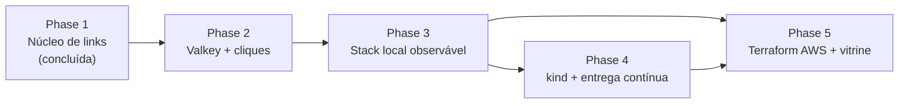

# 10 · Próximas fases

**Em uma frase:** nada deste guia existe ainda no código; ele resume o plano das Phases 2 a 5 descrito no [ROADMAP](../.planning/ROADMAP.md), para você saber o que estudar antes de cada uma.

## Conceitos

### Como ler este guia

Os guias 01 a 09 descrevem o repositório como ele é hoje (Phase 1 concluída). Este guia descreve o que está **planejado**. As fontes são o `.planning/ROADMAP.md` (objetivos e critérios de sucesso de cada fase), a tabela "Decisões Importantes" do `.planning/PROJECT.md` e a pesquisa de stack do `.claude/CLAUDE.md`. Detalhes de implementação podem mudar quando cada fase for planejada; quando o ROADMAP não diz algo, este guia também não diz.

A ordem prevista é 1 → 2 → 3 → 4 → 5, e a parte de Terraform da Phase 5 pode começar logo depois da Phase 3.

### Linha do tempo

## No Link Pulse (planejado)

### Phase 2: Hot path no Valkey e pipeline de cliques

**Objetivo (ROADMAP):** redirects saem do cache Valkey e continuam funcionando se ele cair; cada clique vira um evento processado de forma assíncrona e idempotente no MongoDB, e o cliente consulta estatísticas confiáveis de cada link.

- **Valkey (Redis-compatível).** O que é: um servidor de estruturas de dados em memória, fork de código aberto do Redis, que fala o mesmo protocolo. Strings com TTL, contadores, Lua e Streams funcionam igual. Como vai entrar: cache do redirect, rate limit e fila de cliques. A decisão "Valkey 8.1 em todos os ambientes" (PROJECT.md) busca paridade com o ElastiCache, onde o Redis OSS parou na 7.1.
- **Cache-aside com fail-open.** O que é: a aplicação consulta o cache primeiro; em caso de falta (*miss*), lê o banco e grava no cache. *Fail-open* significa que, se o cache cair, a aplicação segue lendo do banco em vez de falhar. Como vai entrar: o critério 1 pede TTL que nunca passe da expiração do link e cache negativo do 404 invalidado quando o código é criado; o critério 2 pede que, com o Valkey parado, `GET /{code}` continue respondendo 302 via Postgres.
- **Rate limit por IP com script Lua.** O que é: limitar quantas requisições um cliente faz por janela de tempo. Um script Lua roda de forma atômica no servidor, então `INCR` e expiração acontecem juntos, sem corrida. Como vai entrar: `POST /links` acima do limite responde 429 com `Retry-After`, contando o IP real quando a requisição vem de um proxy confiável (critério 5). O `.claude/CLAUDE.md` sugere uma janela fixa em Lua com `INCR` + `PEXPIRE`.
- **Redis Streams com consumer group.** O que é: um log de eventos persistente dentro do Valkey. Produtores fazem `XADD`; um *consumer group* distribui as mensagens entre consumidores, que confirmam o processamento com `XACK`. Mensagens não confirmadas ficam "pendentes" e podem ser reprocessadas. Como vai entrar: o redirect publica o clique no stream sem esperar, e um consumer grava em lote no MongoDB. O critério 4 exige que o `XACK` só aconteça depois da gravação, que pendentes de um consumer morto sejam reprocessados sem duplicata e que lag e pendentes virem métricas.
- **MongoDB e aggregation.** O que é: banco de documentos JSON; o *aggregation pipeline* encadeia estágios (`$match`, `$group`, `$sort`) para calcular relatórios no próprio banco. Como vai entrar: coleção `click_events` (normal, não time-series, porque a idempotência usa `_id` = ID do stream, segundo o PROJECT.md), índices `{code, ts}`, TTL de retenção e nenhum IP em claro. `GET /links/{code}/stats` vai devolver total, cliques por dia, top referrers e top navegadores/SO, sem bots por padrão.
- **Métricas.** `/actuator/prometheus` passa a expor hit/miss do cache, requisições, latência, cliques e pipeline, sem tags por código, URL ou IP (critério 1).

**O que estudar antes:** comandos básicos do Redis (`GET`/`SET` com TTL, `INCR`, `EVAL`), Redis Streams (`XADD`, `XREADGROUP`, `XACK`, `XPENDING`, `XCLAIM`), Spring Data Redis com Lettuce, MongoDB e aggregation pipeline, Micrometer.

### Phase 3: Stack local observável

**Objetivo (ROADMAP):** um avaliador roda `make up`, popula dados de demonstração e vê o encurtador funcionando com métricas reais em dashboards e alertas versionados, com o desempenho comprovado por teste de carga.

- **Imagem Docker multi-stage.** O que é: um Dockerfile com um estágio que compila e outro, menor, só com o runtime. O *layered jar* separa dependências do código para aproveitar o cache de camadas. Como vai entrar: imagem do app com usuário não-root numérico e `HEALTHCHECK` (critério 1).
- **`make up`.** Vai subir app, Postgres, Mongo, Valkey, Prometheus e Grafana na ordem dos healthchecks.
- **Prometheus.** O que é: banco de séries temporais que coleta métricas por *scrape* (puxando de um endpoint HTTP) e avalia regras de alerta. Como vai entrar: alertas de taxa de 5xx, latência p99 alta, lag do consumer e target down, cada um com runbook (critério 3).
- **Grafana.** O que é: ferramenta de dashboards sobre fontes como o Prometheus. Como vai entrar: dashboards versionados em `observability/` (taxa de requisições, p95/p99, cache hit ratio, cliques/min e saúde do pipeline), carregados sem configuração manual.
- **k6.** O que é: ferramenta de teste de carga com scripts em JavaScript e *thresholds* que reprovam o teste. Como vai entrar: cenários de redirect e criação contra o compose, **sem seguir redirects**, com thresholds de p95/p99 e taxa de erro (critério 5).

**O que estudar antes:** Dockerfile multi-stage, Docker Compose com `depends_on` e healthchecks, PromQL (`rate`, `histogram_quantile`), provisioning do Grafana, k6 (`scenarios`, `thresholds`).

### Phase 4: Kubernetes no kind e entrega contínua

**Objetivo (ROADMAP):** um avaliador roda `make k8s` e obtém o mesmo encurtador observável num cluster kind, enquanto o CI publica uma imagem escaneada no GHCR e comprova o deploy com smoke test.

- **kind.** O que é: Kubernetes rodando dentro de containers Docker, para uso local e em CI. Como vai entrar: `make k8s` cria o cluster e instala tudo.
- **Helm.** O que é: gerenciador de pacotes do Kubernetes; um *chart* é um conjunto de templates de manifests com valores configuráveis. Como vai entrar: chart do app com Deployment, Service, Ingress, ConfigMap, Secret e HPA, com values dev/prod (critério 2).
- **Traefik.** O que é: proxy reverso que atua como Ingress controller. Como vai entrar: expõe o app no kind. Substitui o ingress-nginx, aposentado em março de 2026 (PROJECT.md).
- **kube-prometheus-stack.** O que é: chart que instala Prometheus, Grafana e Alertmanager no cluster, com o Prometheus Operator. Como vai entrar: scrape do app via ServiceMonitor e os mesmos dashboards e alertas de `observability/` (critério 3).
- **Probes.** O pod só fica Ready com Postgres e Valkey acessíveis, e derrubar Valkey ou Mongo não reinicia o pod: a liveness não depende de serviços externos (critério 2).
- **GHCR, Trivy e SBOM.** O GitHub Container Registry guarda a imagem; o Trivy procura vulnerabilidades nela; o SBOM (*software bill of materials*) lista seus componentes. Como vai entrar: publicação na `main` e um job que sobe um kind no CI e passa no smoke test criar link → redirect → stats (critérios 4 e 5).

**O que estudar antes:** objetos básicos do Kubernetes (Pod, Deployment, Service, Ingress, ConfigMap, Secret, HPA), probes de liveness e readiness, Helm (templates e values), Prometheus Operator e ServiceMonitor.

### Phase 5: Terraform AWS e vitrine

**Objetivo (ROADMAP):** o avaliador encontra a infraestrutura AWS do app descrita em Terraform e validada em camadas a custo zero, e um README pt-BR que conta a história do projeto com evidências.

- **Terraform.** O que é: ferramenta de infraestrutura como código; você descreve recursos em HCL e o Terraform calcula (`plan`) e aplica (`apply`) as diferenças. Como vai entrar: módulos de rede, ECR, ECS Fargate + ALB, RDS Postgres, ElastiCache Valkey e secrets (critério 1).
- **Validação em camadas.** `fmt`, `validate` e `tflint` em todo PR; `terraform test` com `mock_provider "aws"`, que testa os módulos sem credencial nem custo (critério 2); e, com um token do LocalStack Hobby (`LOCALSTACK_AUTH_TOKEN`, guardado como secret), um `apply` só da parte que o plano gratuito suporta: rede, IAM, logs e secrets (critério 3). Sem o token, o job é pulado sem falhar. O motivo, segundo o PROJECT.md: o LocalStack gratuito não inclui ECS, RDS, ElastiCache nem ECR desde 2026-03.
- **README vitrine.** Diagrama de arquitetura, `make up` e `make k8s`, resultados do k6, prints dos dashboards e trade-offs: 302 vs 301, Valkey, coleção normal vs time-series, Terraform em camadas, escolha do Spring Boot e Mongo na AWS via DocumentDB/Atlas (critério 4).

**O que estudar antes:** fundamentos de AWS (VPC, subnets, security groups, IAM), HCL e módulos do Terraform, `terraform test`, conceitos de ECS Fargate e RDS.

## Por que assim?

- **De dentro para fora:** a visão geral do ROADMAP explica a ordem: primeiro a verdade do link no Postgres, depois o caminho quente e o pipeline de cliques ("a parte de maior risco técnico, atacada cedo"), depois a stack observável, o Kubernetes e, por fim, Terraform e README.
- **Custo zero:** as escolhas de LocalStack Hobby + `mock_provider`, GHCR e kind permitem demonstrar tudo sem conta AWS paga (PROJECT.md).
- **Paridade entre ambientes:** Valkey e Postgres nas mesmas versões no compose, no kind e na AWS.

## Experimente

1. Abra o `.planning/ROADMAP.md` e encontre, para cada fase, os requisitos (`REDIR-03`, `CLICK-01`...) listados em **Requirements**.
2. Escolha um critério de sucesso da Phase 2 e escreva como você testaria isso com Testcontainers.
3. Leia a seção "LEIA PRIMEIRO" do `.claude/CLAUDE.md` e explique, com suas palavras, por que o projeto não usa ingress-nginx nem charts Bitnami.

## Perguntas para fixar

1. O que significa *fail-open* no cache do redirect, e qual critério da Phase 2 o prova?
2. Por que o `XACK` precisa acontecer só depois da gravação no MongoDB?
3. Por que o teste de carga do redirect não deve seguir redirects?
4. Por que a liveness probe não deve depender do Valkey ou do Mongo?
5. Quais partes do Terraform serão aplicadas no LocalStack Hobby, e quais só serão testadas com `mock_provider`?

---

[← Anterior: 09 · Ambiente local e Windows](09-ambiente-local-e-windows.md) · [Voltar ao índice](README.md)
